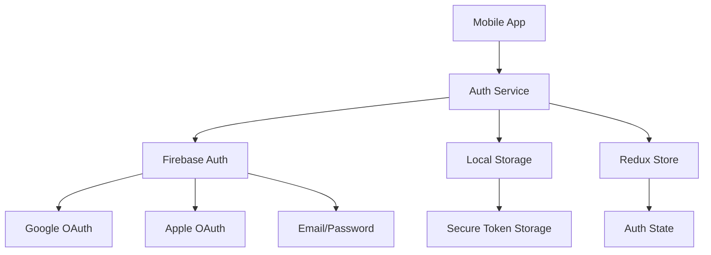

# Authentication Design - Unified Storage App

## Overview
Authentication module that handles user sign-in/sign-up with multiple providers through Firebase Auth, serving as the foundation for all storage operations.

## Architecture



## Components

### 1. Auth Service Layer
**File**: `services/auth.service.ts`

**Interfaces**:
```typescript
interface AuthCredentials {
  email?: string;
  password?: string;
  provider?: 'google' | 'apple' | 'email';
  token?: string;
}

interface AuthResult {
  user: User;
  token: string;
  provider: string;
}

interface User {
  id: string;
  email: string;
  name?: string;
  photoURL?: string;
}
```

**Core Methods**:
```typescript
class AuthService {
  async initialize(): Promise<void>;
  async signIn(credentials: AuthCredentials): Promise<AuthResult>;
  async signUp(email: string, password: string): Promise<AuthResult>;
  async signOut(): Promise<void>;
  async getCurrentUser(): Promise<User | null>;
  async getAuthToken(): Promise<string | null>;
  async resetPassword(email: string): Promise<void>;
  async linkProvider(provider: string): Promise<AuthResult>;
}
```

### 2. Firebase Integration
**File**: `services/auth/firebase-auth.service.ts`

**Implementation**:
```typescript
import auth from '@react-native-firebase/auth';
import { GoogleSignin } from '@react-native-google-signin/google-signin';
import appleAuth from '@invertase/react-native-apple-authentication';

class FirebaseAuthService implements AuthService {
  async initialize() {
    GoogleSignin.configure({
      webClientId: 'YOUR_WEB_CLIENT_ID.apps.googleusercontent.com',
      offlineAccess: true,
    });
  }

  async signInWithGoogle() {
    await GoogleSignin.hasPlayServices();
    const { idToken } = await GoogleSignin.signIn();
    const credential = auth.GoogleAuthProvider.credential(idToken);
    return auth().signInWithCredential(credential);
  }

  async signInWithApple() {
    const appleAuthRequestResponse = await appleAuth.performRequest({
      requestedOperation: appleAuth.Operation.LOGIN,
      requestedScopes: [appleAuth.Scope.EMAIL, appleAuth.Scope.FULL_NAME],
    });
    const credential = auth.AppleAuthProvider.credential(
      appleAuthRequestResponse.identityToken!,
      appleAuthRequestResponse.nonce,
    );
    return auth().signInWithCredential(credential);
  }
}
```

### 3. Redux Store
**File**: `store/slices/authSlice.ts`

```typescript
import { createSlice, PayloadAction } from '@reduxjs/toolkit';

interface AuthState {
  user: User | null;
  token: string | null;
  loading: boolean;
  error: string | null;
}

const initialState: AuthState = {
  user: null,
  token: null,
  loading: false,
  error: null,
};

export const authSlice = createSlice({
  name: 'auth',
  initialState,
  reducers: {
    setCredentials: (state, action: PayloadAction<AuthResult>) => {
      state.user = action.payload.user;
      state.token = action.payload.token;
      state.error = null;
    },
    setLoading: (state, action: PayloadAction<boolean>) => {
      state.loading = action.payload;
    },
    setError: (state, action: PayloadAction<string>) => {
      state.error = action.payload;
      state.loading = false;
    },
    logout: (state) => {
      state.user = null;
      state.token = null;
      state.error = null;
    },
  },
});

export const { setCredentials, setLoading, setError, logout } = authSlice.actions;
export default authSlice.reducer;
```

### 4. UI Components
**Directory**: `components/auth/`

**Files**:
- `LoginScreen.tsx` - Main login screen with provider buttons
- `GoogleSignInButton.tsx` - Google sign-in button component
- `AppleSignInButton.tsx` - Apple sign-in button component
- `EmailAuthForm.tsx` - Email/password form
- `AuthLoading.tsx` - Loading indicator
- `AuthError.tsx` - Error display component

### 5. Secure Storage
**File**: `utils/secureStorage.ts`

```typescript
import * as Keychain from 'react-native-keychain';

export const saveAuthToken = async (token: string) => {
  await Keychain.setGenericPassword('authToken', token, {
    service: 'com.unifiedstorage.auth',
    accessible: Keychain.ACCESSIBLE.WHEN_UNLOCKED,
  });
};

export const getAuthToken = async () => {
  const credentials = await Keychain.getGenericPassword({
    service: 'com.unifiedstorage.auth',
  });
  return credentials ? credentials.password : null;
};

export const clearAuthToken = async () => {
  await Keychain.resetGenericPassword({
    service: 'com.unifiedstorage.auth',
  });
};
```

## Error Handling

| Error Type | Handling Strategy |
|------------|-------------------|
| Network errors | Retry with exponential backoff (max 3 attempts) |
| Invalid credentials | Clear form, show user-friendly error |
| Provider not available | Disable button, show fallback options |
| Rate limiting | Show cooldown message, disable button temporarily |
| Token expiration | Silent re-authentication with refresh token |

## Security Considerations

1. **Token Storage**: Use iOS Keychain and Android Keystore
2. **Token Transmission**: Always use HTTPS, never store in plaintext
3. **Session Management**: Implement token expiration checks
4. **Provider Configuration**: Restrict web client IDs to app bundle IDs
5. **State Validation**: Always validate auth state on app resume

## Testing Strategy

### Unit Tests
- Auth service methods (mock Firebase)
- Redux actions and reducers
- Secure storage operations

### Integration Tests
- Complete sign-in flow with mock providers
- Token storage and retrieval
- Error handling scenarios

### E2E Tests
- Complete authentication flow on real devices
- Provider switching
- Session persistence across app restarts

## Dependencies

```json
{
  "@react-native-firebase/app": "^19.0.0",
  "@react-native-firebase/auth": "^19.0.0",
  "@react-native-google-signin/google-signin": "^10.0.0",
  "@invertase/react-native-apple-authentication": "^2.2.2",
  "react-native-keychain": "^8.0.0",
  "@reduxjs/toolkit": "^2.0.0",
  "react-redux": "^9.0.0"
}
```